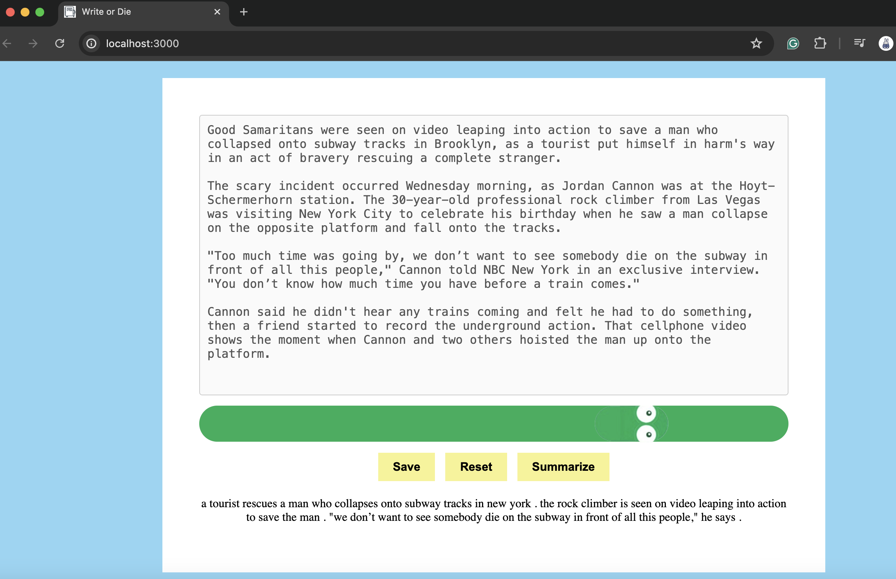

# Write-or-Die

**Write-or-Die** is designed to make essay writing more engaging for students, particularly those in the challenging 5-course Humanities sequence at Revelle College, UC San Diego. This web app helps users get started on their essays by encouraging them to freely brainstorm and then uses AI to summarize their ideas. It aims to transform the writing process into a more enjoyable and productive experience.

Do not stop typing... or else the snake will eat the apple



## Running the Web App
In the project directory run <br> 
build command: ```npm install```<br>
start command: ```npm start```
